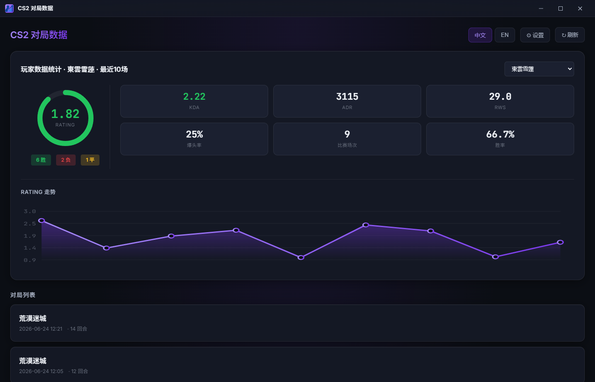
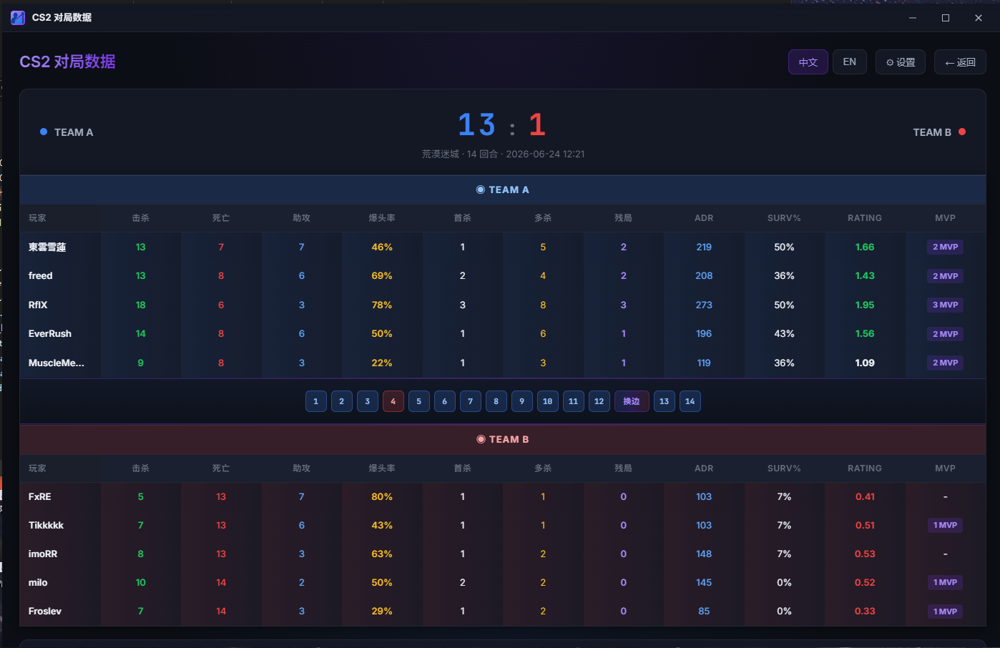
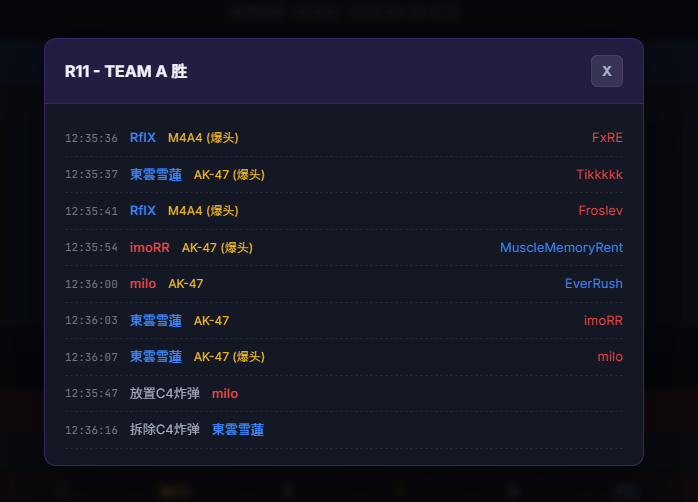

# CS2 Match Stats - Electron Desktop App

<!-- badges -->
[](https://opensource.org/licenses/MIT)
[](https://www.electronjs.org/)
[](https://nodejs.org/)

[中文版 (README.md)](README.md)

<!-- toc -->
## Table of Contents

- [About](#about)
- [Screenshots](#screenshots)
- [Features](#features)
- [Requirements](#requirements)
- [Build Requirements](#build-requirements)
- [Quick Start](#quick-start)
- [Usage](#usage)
- [Functionality](#functionality)
- [Rank System](#rank-system)
- [Data Format](#data-format)
- [Tech Stack](#tech-stack)
- [Project Structure](#project-structure)
- [Development Guide](#development-guide)
- [Build & Release](#build--release)
- [FAQ](#faq)
- [Known Issues](#known-issues)
- [Credits](#credits)
- [License](#license)

---

## About

CS2 Match Stats is a desktop application for Counter-Strike 2 match statistics. Built on the Electron framework, it provides a beautiful graphical interface to view match history, player statistics, and detailed round event information.

This app supports automatic scanning of CS2 installation directories and match history files, so you can get started quickly without manual path configuration.

> 🔗 **Original Project:** [CS2MatchStats](https://github.com/TGP258/CS2_Match_Stats)
>
> 📦 **Original Project Releases:** [Download CS2MatchStats Plugin](https://github.com/TGP258/CS2_Match_Stats/releases)
>
> This project is the Electron desktop version of CS2MatchStats, which requires the original project's plugin to generate match history data.

---

## Screenshots

### Home - Player Stats & Match List



- Intuitive Rating display with ring chart
- Data cards showing KDA, ADR, RWS, Headshot Rate, Matches, Win Rate
- Line chart showing Rating trend over last 10 matches
- Quick browsing of match history

### Match Detail - Scoreboard & Round Indicators



- Final score display
- Complete player statistics scoreboard
- Round progress indicators, click to view round details

### Round Detail - Event Timeline



- Kill events (with weapon, headshot indicator)
- Bomb plant/defuse events
- System time precise to the second

---

## Features

| Feature | Description |
|---------|-------------|
| Auto Scan | Automatically scans Steam, CS2 install paths, and match history directories |
| Custom Paths | Supports manual selection of game installation directories |
| Player Stats | Rating, KDA, ADR, RWS, Headshot Rate, Win Rate, and more |
| Ring Chart | Intuitive Rating display using a ring chart |
| Trend Chart | Line chart showing Rating trends over the last 10 matches |
| Match List | View all historical match records |
| Detailed Scoreboard | Complete player statistics table |
| Round Details | Click round dots to view kill events for each round |
| Event Records | Bomb plant/defuse, headshots, weapon information |
| Side Swap Detection | Auto-detects side swaps and calculates scores correctly |

---

## Requirements

To use the compiled application, the following requirements must be met:

1. **Counter-Strike 2** game installed
2. **CS2MatchStats** plugin installed and running (for generating match records)
3. **Windows 10/11** operating system

---

## Build Requirements

If you need to build this project from source, the following additional requirements must be met:

1. **Node.js 16+** - JavaScript runtime environment
2. **npm** - Node.js package manager (usually installed with Node.js)
3. Stable internet connection (required for downloading Electron binaries on first install)
4. Approximately 1GB of available disk space (dependencies and build artifacts)

---

## Quick Start

### Option 1: Use the compiled installer

1. Download the latest `CS2 Match Stats Setup x.x.x.exe`
2. Double-click to run the installer
3. Follow the wizard to complete installation
4. Launch the application

### Option 2: Run from source

```bash
# Clone the repository
git clone <repository-url>
cd CS2MatchStatsElectron

# Install dependencies
npm install

# Start the application
npm start
```

---

## Usage

### 1. First Launch

After launching, the app will automatically scan your system for CS2 installation paths:

- Automatically scans Steam installation directories
- Detects CS2 game folders
- Finds match_history directories
- Checks CS2MatchStats plugin installation status

### 2. Manual Path Setup

If auto-scan fails, you can manually set the paths:

1. Click the **⚙ Settings** button in the top right
2. Click the **Browse** button next to each path
3. Select the correct folder
4. Settings are saved automatically and loaded on next startup

### 3. View Player Statistics

1. Select a player at the top of the main page
2. View the Rating displayed in the ring chart
3. View KDA, ADR, RWS, headshot rate, and other data
4. View the Rating trend chart for the last 10 matches

### 4. View Match Details

1. Click any match in the match list
2. View the big score and complete scoreboard
3. Click round dots to see detailed events for that round

---

## Functionality

### Auto Scan Service

The app automatically scans the following locations:

| Scan Item | Scan Paths |
|-----------|------------|
| Steam | `Program Files (x86)/Steam`, `Steam`, `SteamLibrary` |
| CS2 | `steamapps/common/Counter-Strike Global Offensive` |
| Match History | `game/csgo/match_history` |
| Plugin | `addons/counterstrikesharp/plugins/` |

### Statistics Explained

| Stat | Description |
|------|-------------|
| Rating | Overall performance score based on kills, deaths, assists, etc. |
| KDA | (Kills + Assists) / Deaths |
| ADR | Average Damage per Round |
| RWS | Round Win Share |
| Headshot Rate | Headshot kills / Total kills |
| Win Rate | Wins / Total matches |

### Data Persistence

The app automatically saves the following configuration:

- Custom path settings (Steam, CS2, match_history)
- Selected player

---

## Rank System

The app features a built-in ELO-inspired ranking system that considers match difficulty, score gap, player performance, and rank difference to calculate EXP gain/loss for each match.

### Rank Tiers

There are 10 ranks, from lowest to highest:

| Rank | EXP Threshold | Color |
|------|--------------|-------|
| D | 0 | Gray |
| D+ | 80 | Light Gray |
| C | 200 | Green |
| C+ | 360 | Light Green |
| B | 560 | Blue |
| B+ | 800 | Light Blue |
| A | 1120 | Purple |
| A+ | 1500 | Magenta |
| S | 2000 | Orange |
| Pro | 2600 | Gold |

New players start at 500 EXP (rank C).

### Match Difficulty

Match difficulty is determined by the `BotDifficulty` field recorded by the plugin (detected via SHA256 hash of CS2-Bot-Improver's `botprofile.vpk` file):

| BotDifficulty | Raw Value |
|---------------|-----------|
| Low | 1 |
| Medium | 2 |
| High | 3 |

When `BotDifficulty` is 0 or unreadable (old data), the match defaults to C+ difficulty.

### Effective Difficulty

The raw difficulty is dynamically adjusted based on match outcome and score gap:

- **On win**: Stomps (larger score gaps) reduce effective difficulty; close matches keep it unchanged
- **On loss**: Being stomped (larger score gaps) increases effective difficulty; close matches keep it unchanged

| Score Gap | Win Adjustment | Loss Adjustment |
|-----------|---------------|----------------|
| ≤1 | ±0 | ±0 |
| 2 | -0.1 | +0.1 |
| 3 | -0.2 | +0.2 |
| 4 | -0.3 | +0.3 |
| 5 | -0.4 | +0.4 |
| ≥6 | -0.5 | +0.5 |

The minimum effective difficulty is 0.5.

### Difficulty Labels

Effective difficulty maps to rank labels:

| Effective Difficulty | Label |
|----------------------|-------|
| ≤0.5 | C |
| ≤1.0 | C+ |
| ≤1.5 | B |
| ≤2.0 | B+ |
| ≤2.5 | A |
| ≤3.0 | A+ |
| ≤3.5 | S |
| >3.5 | Pro |

### EXP Calculation Formula

The EXP for each match is calculated as follows:

**Win:**

```
baseClose = score gap coefficient (low for stomps, high for close matches)
winClose = min(1.0, 1.0 - baseClose × 0.65 + 0.35)  // stomp win > close win
perfBonus = (Rating - 1.0) × 30                     // performance bonus
difficultyFactor = 0.5 + effectiveDifficulty × 0.5
baseGain = BASE(60) × winClose × difficultyFactor + perfBonus
EXP = baseGain × rankDiffMultiplier
```

**Loss:**

```
baseLoss = BASE(60) × baseClose × (0.8 + effectiveDifficulty × 0.4)
EXP = -(baseLoss × rankDiffMultiplier)
```

> Losses do not include performance bonus (perfBonus), preventing high-Rating players from benefiting on both wins and losses.

**Score Gap Coefficient (baseClose):**

| Score Gap | baseClose |
|-----------|-----------|
| ≤2 | 1.00 |
| 3 | 0.95 |
| 4 | 0.85 |
| 5 | 0.75 |
| 6 | 0.65 |
| ≥7 | max(0.3, 1.0 - (scoreGap - 2) × 0.07) |

### Rank Difference Multiplier

The rank difference multiplier is the core mechanism of the system, adjusting EXP based on the difference between **match rank** and **player's current rank**:

- **Higher rank in lower match**: Win gains are greatly reduced, loss penalties are greatly increased (prevents farming)
- **Lower rank in higher match**: Win gains are greatly increased, loss penalties are reduced (encourages challenging higher difficulties)

| Rank Diff | Win Multiplier | Loss Multiplier | Description |
|-----------|---------------|-----------------|-------------|
| -4 | 0.10 | 0.15 | 4 ranks higher in lower match, almost no EXP |
| -3 | 0.25 | 0.25 | |
| -2 | 0.50 | 0.40 | 1/3~1/2 of same-rank |
| -1 | 0.75 | 0.70 | |
| 0 | 1.00 | 1.00 | Same rank, normal |
| +1 | 1.50 | 1.40 | |
| +2 | 2.00 | 1.80 | 1.5~2× |
| +3 | 2.50 | 2.30 | |
| +4 | 2.80 | 2.80 | 2.5~3× |

> Rank diff = match rank index - player rank index (positive = match is higher than player)

### Total EXP Calculation

Total EXP uses a **70% recent + 30% overall** weighted average:

1. EXP is calculated iteratively in chronological order, using the player's rank at the time of each match for the rank difference multiplier
2. Recent 10 matches EXP sum × 0.7 + all matches EXP sum × 0.3 = Total EXP
3. Current rank and progress are determined by mapping total EXP to rank thresholds

### Single-Match Player Rule

Players with only one match played (typically BOTs disguised as real players) display their rank as the match difficulty label + `?`, e.g. `B?`, `A+?`.

### BOT Rank Direction

BOT rank fitting works in reverse compared to real players: when a BOT stomps a real player in a match, the BOT's displayed rank is higher (e.g. C+ match, BOT wins → displays B).

---

## Data Format

Match records are saved in JSON files, consistent with the CS2MatchStats plugin format.

```json
{
  "MapName": "de_dust2",
  "StartTime": "2024-01-01T12:00:00",
  "EndTime": "2024-01-01T12:15:30",
  "Duration": 930,
  "Teams": {
    "CT": {
      "Name": "Counter-Terrorists",
      "Score": 16,
      "Players": {}
    },
    "T": {
      "Name": "Terrorists",
      "Score": 12,
      "Players": {}
    }
  },
  "Rounds": [
    {
      "RoundNumber": 1,
      "Winner": "CT",
      "Events": []
    }
  ]
}
```

---

## Tech Stack

| Layer | Technology |
|-------|------------|
| Framework | Electron 28.x |
| Frontend | Native HTML5 + CSS3 + JavaScript |
| Charts | Native SVG (ring chart, line chart) |
| Communication | IPC (Main process ↔ Renderer process) |
| Packaging | electron-builder |
| Languages | Bilingual (Chinese / English) |

---

## Project Structure

```
CS2MatchStatsElectron/
├── main.js                    # Electron main process
├── preload.js                 # Preload script (IPC API exposure)
├── package.json               # Project configuration
├── generate-icon.js           # Icon generation script
├── public/                    # Renderer process resources
│   ├── index.html             # Main page
│   ├── logo.png               # App icon (PNG)
│   └── icon.ico               # App icon (ICO)
├── release/                   # Build output directory
│   ├── CS2 Match Stats Setup x.x.x.exe  # Installer
│   └── win-unpacked/          # Portable version
└── node_modules/              # Dependencies
```

---

## Development Guide

### Environment Setup

```bash
# Install dependencies
npm install

# For users in China, set up mirror for faster downloads
npm config set ELECTRON_MIRROR https://npmmirror.com/mirrors/electron/
```

### Development & Debugging

```bash
# Start development mode
npm start

# Enable logging
npm run dev
```

### Code Structure

- **main.js**: Main process, handles window management, path scanning, file operations, IPC communication
- **preload.js**: Preload script, safely exposes APIs to the renderer process
- **public/index.html**: Frontend UI, contains all page rendering logic and charts

---

## Build & Release

### Windows Platform

```bash
# Build installer
npm run build:win

# Or use the general command
npm run build
```

Build artifacts are located in the `release/` directory:

- `CS2 Match Stats Setup x.x.x.exe` - NSIS installer
- `win-unpacked/` - Portable version

### Build Configuration

Configure in the `build` field of `package.json`:

```json
{
  "build": {
    "appId": "com.cs2matchstats.app",
    "productName": "CS2 Match Stats",
    "win": {
      "target": ["nsis"],
      "icon": "public/icon.ico"
    }
  }
}
```

---

## FAQ

### Q: The app shows an empty page after launch?

**A:** Please check:
1. CS2 game is installed
2. Match history directory exists and contains JSON files
3. If paths are incorrect, manually specify them in Settings

### Q: Can't find match records?

**A:** Please check:
1. CS2MatchStats plugin is correctly installed
2. At least one full match has been played
3. There are `match_*.json` files in the match_history directory

### Q: Auto scan failed?

**A:** You can manually set paths:
1. Click the Settings button in the top right
2. Click Browse to select each folder
3. Path settings are saved automatically

### Q: How to update the application?

**A:** Download the latest installer and install over the existing version. Configuration data will be preserved.

---

## Known Issues

The following are known issues in the current version that have not yet been resolved:

| Issue | Description |
|-------|-------------|
| **MVP calculation bug** | MVP count per match may be inaccurate and may deviate from in-game MVP count |
| **Assist statistics deviation** | Assist data may not match in-game actual data; some assists may not be properly recorded |
| **Team kills counted in KD** | Team kills (TK) are currently incorrectly included in kill data, affecting KD and Rating calculations |

These issues are due to limitations in the original data collection and will be gradually fixed in future versions.

---

## Credits

This project is developed based on the following open source projects:

| Project | Description |
|---------|-------------|
| [CS2MatchStats](https://github.com/TGP258/CS2_Match_Stats) | Original project, provides data format and web version reference |
| [CS2-Bot-Improver](https://github.com/ed0ard/CS2-Bot-Improver) | Original project, provides CounterStrikeSharp framework integration |
| [CounterStrikeSharp](https://github.com/roflmuffin/CounterStrikeSharp) | CS2 server plugin framework |
| [Electron](https://www.electronjs.org/) | Cross-platform desktop application framework |
| [electron-builder](https://www.electron.build/) | Electron packaging tool |

Special thanks to all developers who contribute to the open source community.

---

## License

This project is developed based on CS2MatchStats and follows the original project's license.
